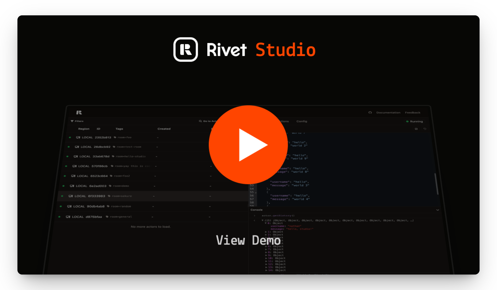

<div align="center">
  <a href="https://actorcore.org">
    <picture>
      <source media="(prefers-color-scheme: dark)" srcset="./.github/media/icon-text-white.svg" alt="ActorCore" width="250">
      
    </picture>
  </a>
  <h2>Stateful Serverless That Runs Anywhere</h2>
  <p>
    The easiest way to build <strong>stateful</strong>, <strong>AI agent</strong>, <strong>collaborative</strong>, or <strong>local-first</strong> applications.<br/>
    Deploy to Rivet, Cloudflare, Bun, Node.js, and more.
  </p>

  <p>
    <a href="https://actorcore.org/overview">Documentation</a> •
    <a href="https://discord.gg/rivet">Discord</a> •
    <a href="https://x.com/ActorCore_org">X</a> •
    <a href="https://bsky.app/">Bluesky</a>
  </p>
</div>

## Quickstart

**Start By Framework**

- &nbsp;&nbsp;[React](https://actorcore.org/frameworks/react)
- &nbsp;&nbsp;[Node.js & Bun](https://actorcore.org/clients/javascript)
- &nbsp;&nbsp;[Rust](https://actorcore.org/clients/rust)

**Start With Studio**

&nbsp;&nbsp;[Open Studio](https://studio.rivet.gg)

**Start With Template**

```bash
npx create-actor@latest
```

## What is Stateful Serverless?

<br/>

**&nbsp;&nbsp;Long-Lived, Stateful Compute**  

Each unit of compute is like a tiny server that remembers things between requests – no need to reload data or worry about timeouts. Like AWS Lambda, but with memory and no timeouts.

<br/>

&nbsp;&nbsp;**Durable State Without a Database**  

Your code's state is saved automatically—no database, ORM, or config needed. Just use regular JavaScript objects or SQLite (available in April).

<br/>

&nbsp;&nbsp;**Blazing-Fast Reads & Writes**  

State is stored on the same machine as your compute, so reads and writes are ultra-fast. No database round trips, no latency spikes.

<br/>

&nbsp;&nbsp;**Realtime, Made Simple**  

Update state and broadcast changes in realtime. No external pub/sub systems, no polling – just built-in low-latency events.

<br/>

&nbsp;&nbsp;**Store Data Near Your Users**  

Your state lives close to your users on the edge – not in a faraway data center – so every interaction feels instant.

<br/>

&nbsp;&nbsp;**Serverless & Scalable**  

No servers to manage. Your code runs on-demand and scales automatically with usage.

<br/>

*[Have more questions? Jump to our FAQ →](#frequently-asked-questions)*

## Examples

Browse snippets for how to use ActorCore with different use cases.

| Example | Actor (JavaScript) | Actor (SQLite) | Frontend (React) |
|---------|------------|--------|-------|
| Chat Room | [actor.ts](/examples/snippets/chat-room/actor-json.ts) | [actor.ts](/examples/snippets/chat-room/actor-sqlite.ts) | [App.tsx](/examples/snippets/chat-room/App.tsx) |
| AI Agent | [actor.ts](/examples/snippets/ai-agent/actor-json.ts) | [actor.ts](/examples/snippets/ai-agent/actor-sqlite.ts) | [App.tsx](/examples/snippets/ai-agent/App.tsx) |
| Local-First Sync | [actor.ts](/examples/snippets/sync/actor-json.ts) | [actor.ts](/examples/snippets/sync/actor-sqlite.ts) | [App.tsx](/examples/snippets/sync/App.tsx) |
| Per-Tenant SaaS | [actor.ts](/examples/snippets/tenant/actor-json.ts) | [actor.ts](/examples/snippets/tenant/actor-sqlite.ts) | [App.tsx](/examples/snippets/tenant/App.tsx) |
| Per-User Databases | [actor.ts](/examples/snippets/database/actor-json.ts) | [actor.ts](/examples/snippets/database/actor-sqlite.ts) | [App.tsx](/examples/snippets/database/App.tsx) |
| Yjs CRDT | [actor.ts](/examples/snippets/crdt/actor-json.ts) | [actor.ts](/examples/snippets/crdt/actor-sqlite.ts) | [App.tsx](/examples/snippets/crdt/App.tsx) |
| Collaborative Document | [actor.ts](/examples/snippets/document/actor-json.ts) | [actor.ts](/examples/snippets/document/actor-sqlite.ts) | [App.tsx](/examples/snippets/document/App.tsx) |
| Stream Processing | [actor.ts](/examples/snippets/stream/actor-json.ts) | [actor.ts](/examples/snippets/stream/actor-sqlite.ts) | [App.tsx](/examples/snippets/stream/App.tsx) |
| Multiplayer Game | [actor.ts](/examples/snippets/game/actor-json.ts) | [actor.ts](/examples/snippets/game/actor-sqlite.ts) | [App.tsx](/examples/snippets/game/App.tsx) |
| Rate Limiter | [actor.ts](/examples/snippets/rate/actor-json.ts) | [actor.ts](/examples/snippets/rate/actor-sqlite.ts) | [App.tsx](/examples/snippets/rate/App.tsx) |

_SQLite will be available in late April. We’re working on publishing full examples related to these snippets. If you find an error, please create an issue._

## Runs On Your Stack

Deploy ActorCore anywhere - from serverless platforms to your own infrastructure. Don't see the runtime you want? [Add your own](http://localhost:3000/drivers/build).

### All-In-One
- &nbsp;&nbsp;[Rivet](/platforms/rivet)
- &nbsp;&nbsp;[Cloudflare Workers](/platforms/cloudflare-workers)

### Compute
- &nbsp;&nbsp;[Vercel](https://github.com/rivet-gg/actor-core/issues/897) *(On The Roadmap)*
- &nbsp;&nbsp;[AWS Lambda](https://github.com/rivet-gg/actor-core/issues/898) *(On The Roadmap)*
- &nbsp;&nbsp;[Supabase](https://github.com/rivet-gg/actor-core/issues/905) *(Help Wanted)*
- &nbsp;&nbsp;[Bun](/platforms/bun)
- &nbsp;&nbsp;[Node.js](/platforms/nodejs)

### Storage
- &nbsp;&nbsp;[Redis](/drivers/redis)
- &nbsp;&nbsp;[Postgres](https://github.com/rivet-gg/actor-core/issues/899) *(Help Wanted)*
- &nbsp;&nbsp;[File System](/drivers/file-system)
- &nbsp;&nbsp;[Memory](/drivers/memory)

## Works With Your Tools

Seamlessly integrate ActorCore with your favorite frameworks, languages, and tools. Don't see what you need? [Request an integration](https://github.com/rivet-gg/actor-core/issues/new).

### Frameworks
- &nbsp;&nbsp;[React](/frameworks/react)
- &nbsp;&nbsp;[Next.js](https://github.com/rivet-gg/actor-core/issues/904) *(Help Wanted)*
- &nbsp;&nbsp;[Vue](https://github.com/rivet-gg/actor-core/issues/903) *(Help Wanted)*

### Clients
- &nbsp;&nbsp;[JavaScript](/clients/javascript)
- &nbsp;&nbsp;[TypeScript](/clients/javascript)
- &nbsp;&nbsp;[Python](https://github.com/rivet-gg/actor-core/issues/900) *(Available In April)*
- &nbsp;&nbsp;[Rust](/clients/rust)

### Integrations
- &nbsp;&nbsp;[Hono](/integrations/hono)
- &nbsp;&nbsp;[Resend](/integrations/resend)
- &nbsp;&nbsp;[Better Auth](https://github.com/rivet-gg/actor-core/issues/906) *(On The Roadmap)*
- &nbsp;&nbsp;[AI SDK](https://github.com/rivet-gg/actor-core/issues/907) *(On The Roadmap)*

### Local-First Sync
- &nbsp;&nbsp;[LiveStore](https://github.com/rivet-gg/actor-core/issues/908) *(Available In May)*
- &nbsp;&nbsp;[ZeroSync](https://github.com/rivet-gg/actor-core/issues/909) *(Help Wanted)*
- &nbsp;&nbsp;[TinyBase](https://github.com/rivet-gg/actor-core/issues/910) *(Help Wanted)*
- &nbsp;&nbsp;[Yjs](https://github.com/rivet-gg/actor-core/issues/911) *(Help Wanted)*

## Local Development with the Studio

<p>Like Postman, but for all of your stateful serverless needs.</p>

<p><a href="https://studio.rivet.gg">Visit The Studio →</a></p>

<a href="https://www.youtube.com/watch?v=RYgo25fH9Ss"></a>

## Join the Community

Help make ActorCore the universal way to build & scale stateful serverless applications.

- [Discord](https://rivet.gg/discord)
- [X](https://x.com/ActorCore_org)
- [Bluesky](https://bsky.app/profile/rivet.gg)
- [Discussions](https://github.com/rivet-gg/actor-core/discussions)
- [Issues](https://github.com/rivet-gg/actor-core/issues)

## Frequently Asked Questions

<details>
<summary><strong>How is ActorCore different than Rivet Actors?</strong></summary>

ActorCore is a framework written in TypeScript that provides high-level functionality. Rivet is an open-source serverless platform written in Rust with features tailored for stateful serverless.

You can think of it as ActorCore is to Rivet as Next.js is to Vercel.

While Rivet is the primary maintainer of ActorCore, we intend for this to be community driven.
</details>

<details>
<summary><strong>How does stateful serverless compare to the traditional actor model?</strong></summary>

Stateful serverless is very similar to actors: it's essentially actors with persistence, and usually doesn't have as rigid constraints on message handling. This makes it more flexible while maintaining the core benefits of the actor model.
</details>

<details>
<summary><strong>How do stateful and stateless serverless work together?</strong></summary>

Stateless serverless works well when you have an external resource that maintains state. Stateful serverless, on the other hand, is almost like a mini-database.

Sometimes it makes sense to use stateless serverless to make requests to multiple stateful serverless instances, orchestrating complex operations across multiple state boundaries.
</details>

<details>
<summary><strong>How does ActorCore achieve huge performance gains?</strong></summary>

By storing state in memory and flushing to a persistence layer, we can serve requests instantly instead of waiting for a round trip to the database. There are additional optimizations that can be made around your state to tune the durability of it.

Additionally, data is stored near your users at the edge, ensuring round-trip times of less than 50ms when they request it. This edge-first approach eliminates the latency typically associated with centralized databases.
</details>

<details>
<summary><strong>Isn't well-designed software supposed to separate compute and storage?</strong></summary>

Some software makes sense to separate – e.g., for data lakes or highly relational data. But at the end of the day, data has to be partitioned somewhere at some point.

Usually "faster" databases like Cassandra, DynamoDB, or Vitess make consistency tradeoffs to get better performance. Stateful serverless forces you to think about how your data is sharded for better performance, better scalability, and less consistency footguns.
</details>

<details>
<summary><strong>What is stateful serverless not good for?</strong></summary>

OLAP, data lakes, graph databases, and highly relational data are currently not ideal use cases for stateful serverless, though it will get better at handling these use cases over time.
</details>

<details>
<summary><strong>Can this create a single bottleneck?</strong></summary>

Yes, but only as much as storing data in a single database row does. We're working on building out read replicas to allow you to perform read-only actions on actors.
</details>

<details>
<summary><strong>Stateless serverless is standardized under WinterTC. Is there any intention to standardize stateful serverless?</strong></summary>

Things are cooking! Check out our [blog post](https://rivet.gg/blog/2025-03-23-what-would-a-w3c-standard-look-like-for-stateful-serverless-) about what a W3C standard for stateful serverless might look like and [the awesome people who are collaborating on this](https://x.com/threepointone/status/1903579571028390038).
</details>

Have more questions? Join our [Discord](https://discord.gg/rivet) or go to [GitHub Discussions](https://github.com/rivet-gg/actor-core/discussions).

## Roadmap For 2025

We ship fast, so we want to share what you can expect to see before the end of the year.
Help shape our roadmap by [creating issues](https://github.com/rivet-gg/actor-core/issues) and [joining our Discord](https://rivet.gg/discord).

- [ ] SQLite Support
- [ ] Oodles Of Examples
- [ ] SQLite in Studio
- [ ] Local-First Extensions
- [ ] Auth Extensions
- [ ] Workflows
- [ ] Queues
- [ ] MCP
- [ ] Actor-Actor Actions
- [ ] Cancellable Schedules
- [ ] Cron Jobs
- [ ] Drizzle Support
- [ ] Prisma v7 Support
- [ ] Read Replicas
- [ ] Middleware
- [ ] Schema Validation
- [ ] Vite Integration
- [ ] OpenTelemetry
- [X] Studio
- [X] File system driver
- [X] React client
- [X] Rust client
- [X] Resend Integration
- [X] Vitest Integration
- [X] Non-serialized state
- [X] `create-actor`
- [X] `actor-core dev`
- [X] Hono Integration

## License

Apache 2.0

_Scale without drama – only with ActorCore._

