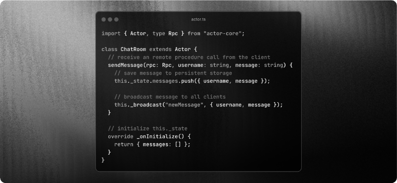

<p align="center">
  <a href="https://actorcore.org">
    <picture>
      <source media="(prefers-color-scheme: dark)" srcset="./.github/media/icon-text-white.svg" alt="ActorCore" width="400">
      
    </picture>
  </a>
</p>

<h3 align="center">The Stateful Serverless Framework</h3>
<h4 align="center">
  Build AI agents, realtime apps, game servers, and more.<br/>
  Supports Rivet, Cloudflare Workers, Bun, and Node.js.
</h4>
<p align="center">
  <!-- <a href="https://github.com/rivet-gg/rivet/graphs/commit-activity"></a> -->
  <a href="https://github.com/orgs/rivet-gg/discussions"></a>
    <a href="https://rivet.gg/discord"></a>
   <a href="https://twitter.com/rivet_gg"></a>
   <a href="https://bsky.app/profile/rivet.gg"></a>
  <a href="/LICENSE"></a>
</p>



## Intro

### Features

- 🔋 **Batteries Included**: State, RPC, events, & scheduling included out of the box.
- 💾 **Persistent & In-Memory**: Supports storing actor state in-memory that's automatically persisted for high-performance workloads.
- ⚡ **Multiplayer & Realtime**: Build realtime or multiplayer applications on top of actors. :floppy_disk:
- ⚙️ **Serverless & Scalable**: Built on your serverless runtime of choice to make deploying, scaling, and cost management easy. :microchip:

### Supported Platforms

- [**Rivet**](https://actorcore.org/platforms/rivet)
- [**Cloudflare Workers**](https://actorcore.org/platforms/cloudflare-workers)
- [**Bun**](https://actorcore.org/platforms/bun)
- [**Node.js**](https://actorcore.org/platforms/nodejs)
<!--- [**Supabase Edge Functions**](https://actorcore.org/platforms/supabase) - Serverless platform-->
<!--- [**Vercel**](https://actorcore.org/platforms/vercel) - Serverless platform-->

### Use Cases

ActorCore is ideal for applications that need coordinated state across multiple clients. Some common use cases include:

- AI agents
- Game Servers
- Collaborative applications
- Local-first apps
- Discord Activities
- Chat Apps
- Yjs Sync & Storage
- Sandboxed Code Execution

By handling the complexities of state management and coordination, ActorCore lets you focus on building your application logic rather than wrestling with distributed systems primitives.

## Getting Started

### Step 1: Installation

```bash npm
# npm
npm add actor-core

# pnpm
pnpm add actor-core

# Yarn
yarn add actor-core

# Bun
bun add actor-core
```

### Step 2: Create an Actor

```typescript
import { Actor, type Rpc } from "actor-core";

export interface State {
    messages: { username: string; message: string }[];
}

export default class ChatRoom extends Actor<State> {
    // initialize this._state
    _onInitialize() {
        return { messages: [] };
    }

    // receive an remote procedure call from the client
    sendMessage(rpc: Rpc<ChatRoom>, username: string, message: string) {
        // save message to persistent storage
        this._state.messages.push({ username, message });

        // broadcast message to all clients
        this._broadcast("newMessage", username, message);
    }
}
```

### Step 3: Connect to Actor

```typescript
import { Client } from "actor-core/client";
import type ChatRoom from "../src/chat-room.ts";

const client = new Client(/* manager endpoint */);

// connect to chat room
const chatRoom = await client.get<ChatRoom>({ name: "chat" });

// listen for new messages
chatRoom.on("newMessage", (username: string, message: string) =>
    console.log(`Message from ${username}: ${message}`),
);

// send message to room
await chatRoom.sendMessage("william", "All the world's a stage.");
```

### Step 4: Deploy

Deploy to your platform of choice:

- [**Rivet**](https://actorcore.org/platforms/rivet)
- [**Cloudflare Workers**](https://actorcore.org/platforms/cloudflare-workers)
- [**Bun**](https://actorcore.org/platforms/bun)
- [**Node.js**](https://actorcore.org/platforms/nodejs)

## Community & Support

-   Join our [**Discord**](https://rivet.gg/discord)
-   Follow us on [**X**](https://x.com/rivet_gg)
-   Follow us on [**Bluesky**](https://bsky.app/profile/rivet-gg.bsky.social)
- File bug reports in [**GitHub Issues**](https://github.com/rivet-gg/ActorCore/issues)
- Post questions & ideas in [**GitHub Discussions**](https://github.com/orgs/rivet-gg/discussions)

## License

Apache 2.0
